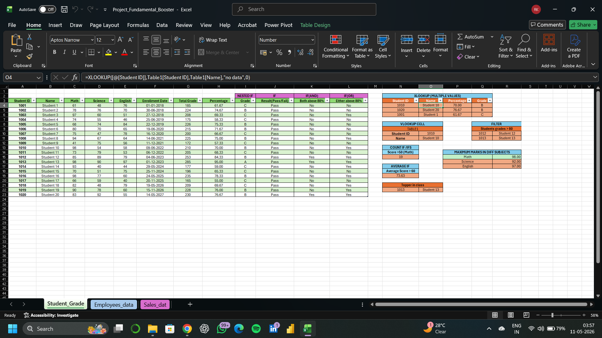
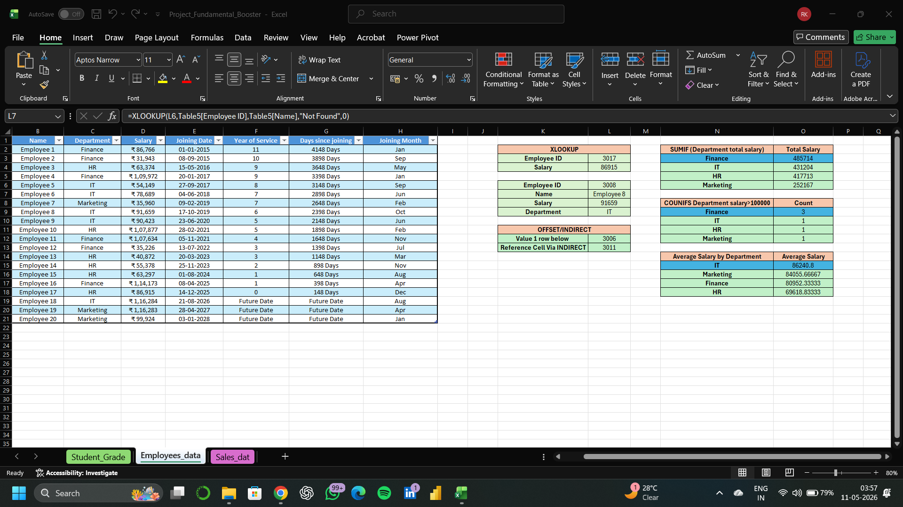
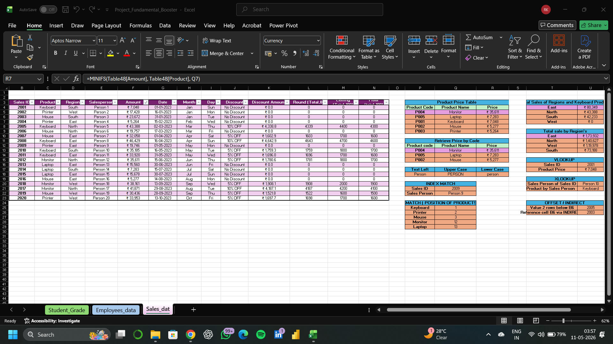

# 📊 Excel Fundamental Booster — Multi-Sheet Formula Project

A comprehensive Excel project covering 20+ essential formulas across 3 real-world datasets — Student Grades, Employee Data, and Sales Data — demonstrating advanced lookup, logical, statistical, and reference functions used in professional Data Analysis.

---

## 📌 Project Overview

This project applies Excel's most important functions across 3 structured datasets to answer real business questions — from finding student toppers to calculating department salaries and regional sales performance.

---

## 🗂️ 3 Sheets Overview

### 📚 Sheet 1 — Student_Grade
| Feature | Details |
|---|---|
| Dataset | 20 students with Math, Science, English marks |
| Total Grade & Percentage | Calculated using `SUM`, `AVERAGE` |
| Grade Assignment | `NESTED IF` — A, B, C based on percentage |
| Pass/Fail Result | `IF` function |
| Both Above 80% | `IF(AND)` |
| Either Above 80% | `IF(OR)` |
| Lookup by Student ID | `XLOOKUP (Multiple Values)` |
| Lookup Single Value | `VLOOKUP` |
| Filter High Scorers | `FILTER` — Students grades > 80 |
| Count High Scorers | `COUNTIF` — Math score > 50 |
| Average IF | `AVERAGEIF` — Average score > 60 |
| Max Marks Per Subject | `MAXIFS` — Math, Science, English |
| Class Topper | `XLOOKUP` with MAX |

### 👔 Sheet 2 — Employees_Data
| Feature | Details |
|---|---|
| Dataset | 20 employees across Finance, IT, HR, Marketing |
| Years of Service | `DATEDIF` from joining date |
| Days Since Joining | `TODAY() - Joining Date` |
| Joining Month | `TEXT` function |
| Future Date Detection | `IF` with `TODAY()` |
| Lookup by Employee ID | `XLOOKUP` — Name, Salary, Department |
| Reference Navigation | `OFFSET` / `INDIRECT` |
| Total Salary by Dept | `SUMIF` |
| Count by Salary Range | `COUNTIFS` — Salary > 100000 |
| Average Salary by Dept | `AVERAGEIF` |

### 🛒 Sheet 3 — Sales_Data
| Feature | Details |
|---|---|
| Dataset | 20 sales records — Products, Regions, Salespersons |
| Discount Logic | `IF` — 5% OFF, 10% OFF, No Discount |
| Discount Amount | `IF` with percentage calculation |
| Round Total | `ROUND` function |
| Product Price Table | `XLOOKUP` by product code |
| Total Sales by Region | `SUMIF` — East, North, South, West |
| Lookup by Sales ID | `VLOOKUP` — Product Price |
| Advanced Lookup | `XLOOKUP` — Sales Person & Product |
| Index Position | `MATCH` — Position of each product |
| Combined Lookup | `INDEX MATCH` |
| Text Formatting | `LEFT`, `UPPER`, `LOWER` |
| Reference Navigation | `OFFSET` / `INDIRECT` |
| Min Sale by Product | `MINIFS` |

---

## 🛠️ Tech Stack

- **Tool:** Microsoft Excel
- **Functions Used:** `IF`, `NESTED IF`, `AND`, `OR`, `XLOOKUP`, `VLOOKUP`, `INDEX MATCH`, `SUMIF`, `COUNTIF`, `AVERAGEIF`, `MAXIFS`, `MINIFS`, `OFFSET`, `INDIRECT`, `MATCH`, `DATEDIF`, `TEXT`, `ROUND`, `UPPER`, `LOWER`, `LEFT`, `FILTER`
- **Features:** Structured Tables, Conditional Formatting, Multiple Sheets

---

## 📁 Project Structure

```
excel-fundamental-booster/
│
├── Project_Fundamental_Booster.xlsx   # Main Excel file (3 sheets)
├── screenshots/
│   ├── student_grade_sheet.png        # Sheet 1 preview
│   ├── employees_data_sheet.png       # Sheet 2 preview
│   └── sales_data_sheet.png           # Sheet 3 preview
└── README.md                          # Project documentation
```

---

## 📸 Screenshots

### Sheet 1 — Student Grade Analysis


### Sheet 2 — Employee Data Analysis


### Sheet 3 — Sales Data Analysis


---

## 💡 What I Learned

- Applying 20+ Excel functions across real-world datasets
- Using `XLOOKUP` for multi-value lookups with error handling
- Combining `INDEX` + `MATCH` for flexible two-way lookups
- Using `OFFSET` and `INDIRECT` for dynamic cell referencing
- Calculating date differences with `DATEDIF` and `TODAY()`
- Applying conditional aggregation with `SUMIF`, `COUNTIFS`, `AVERAGEIF`, `MAXIFS`, `MINIFS`
- Building nested `IF` logic for grade and discount classification

---
